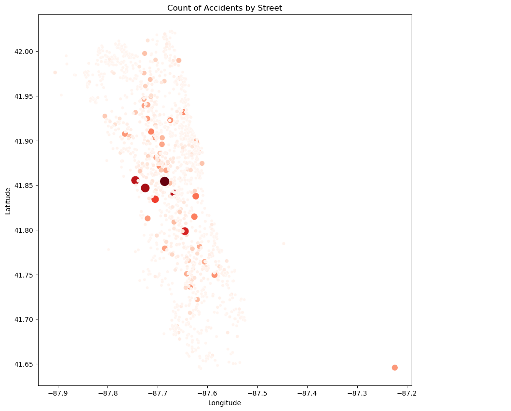

# Chicago_Car_Crashes_Analysis

# Overview

The project investigates car crash patterns in Chicago for an autonomous vehicles firm and the Vehicle Safety Board of Chicago. Leveraging data from the city's official source, Chicago Data Portal, the project aims to shed light on critical aspects of road safety. The mission is to analyze the data and harness its insights to enhance safety measures and reduce accidents.

# Business Understanding 

>- Business Objective: Launching an unmanned vehicle business in Chicago.

>- Key Goal: Utilize data insights to ensure the success and safety of autonomous transportation services.

>- Specific Focus: Understanding crash patterns in Chicago.

# Data Understanding and Observations 

There are three separate data: crashes, people, and vehicles. The data can be found here: [Chicago Traffic Crashes Data](https://data.cityofchicago.org/Transportation/Traffic-Crashes-Crashes/85ca-t3if)

Following the comprehensive explanatory data analysis, several intriguing patterns and findings emerged. One of the most noticeable observations was that most accidents occurred during clear weather conditions, with dry road surfaces. Additionally, the data showed a peak in accidents during peak commuting hours. This insight aligns with the general understanding that increased traffic during rush hours can lead to a higher likelihood of collisions.

When I looked at the data, I saw that some streets had more accidents than others. 

 

It's clear that not every street has the same level of safety. Why is this? Maybe some streets are built differently, or there's more traffic on them. Or maybe it's the way people drive on certain roads. We need to understand this better because knowing why can help make these streets safer in the future.

# Modelling 

Multiple models were assessed to predict high-frequency accident streets. The dummy model, a baseline model, predominantly leaned towards predicting the majority class, showcasing its inefficiency in capturing the essence of the minority class with an F1-score of 0.43 for the macro average. Moving to logistic regression without SMOTE, there was a noticeable improvement in classifying the minority class with a macro average F1-score of 0.56. Implementing SMOTE further enhanced this, balancing out the training data, and achieved a slightly better macro average F1-score of 0.57. Finally, hyperparameter tuning with GridSearchCV on the SMOTE-resampled data did not significantly alter the model's performance, suggesting that the initial parameters used with SMOTE were near optimal for this dataset. Throughout, the models consistently improved in capturing the minority class instances, which was evident from the increase in recall from the dummy model to the SMOTE-based models.

# Results 

The findings underscore the necessity of understanding both the physical infrastructure of roads and the control measures in place when assessing accident risks. Future safety interventions should consider these insights to develop effective strategies for accident reduction.

# Limitations and Next Steps 

Note that correlation is not causation! The logistic regression report and coefficients show correlation between features and the likelihood of a street being high-frequency in terms of accidents. However, they don't prove causation. 

Limitations:

>- The dataset does not encompass all potential variables, particularly those related to driver behavior and distractions like cell phone use, which has become a common cause of accidents in recent times.
  
 >- Dependence on Available Features: The regression analysis, although revealing, relies heavily on the given features in the dataset. It may not encapsulate all factors contributing to high-frequency accidents.
  
 Next Steps:

>- Expand Data Collection: Given the importance of factors like driver behavior and distractions, efforts should be made to include these in future datasets. 

>-  Having a a binning system, distinguishing between human-related and external factors influencing accident frequencies.

