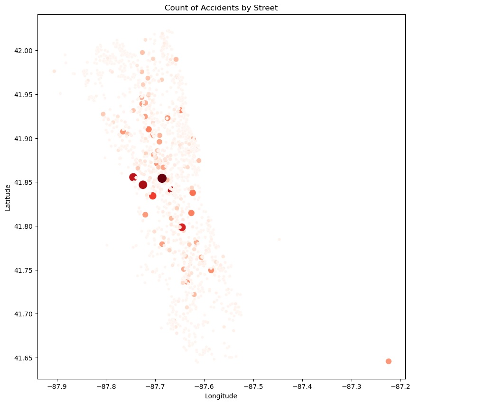

# Chicago_Car_Crashes_Analysis

# Overview

The project investigates car crash patterns in Chicago for an autonomous vehicles firm and the Vehicle Safety Board of Chicago. Leveraging data from the city's official source, Chicago Data Portal, the project aims to shed light on critical aspects of road safety. The mission is to analyze the data and harness its insights to enhance safety measures and reduce accidents.

# Business Understanding 

>- Business Objective: Launching an unmanned vehicle business in Chicago.

>- Key Goal: Utilize data insights to ensure the success and safety of autonomous transportation services.

>- Specific Focus: Understanding crash patterns in Chicago.

# Data Understanding and Observations 

There are three separate data: crashes, people, and vehicles. The data can be found here: [Chicago Traffic Crashes Data](https://data.cityofchicago.org/Transportation/Traffic-Crashes-Crashes/85ca-t3if)

Following the comprehensive explanatory data analysis, several intriguing patterns and findings emerged. One of the most noticeable observations was that most accidents occurred during clear weather conditions, with dry road surfaces. Additionally, the data showed a peak in accidents during peak commuting hours. This insight aligns with the general understanding that increased traffic during rush hours can lead to a higher likelihood of collisions.

When I looked at the data, I saw that some streets had more accidents than others. 

It's clear that not every street has the same level of safety. Why is this? Maybe some streets are built differently, or there's more traffic on them. Or maybe it's the way people drive on certain roads. We need to understand this better because knowing why can help make these streets safer in the future.

